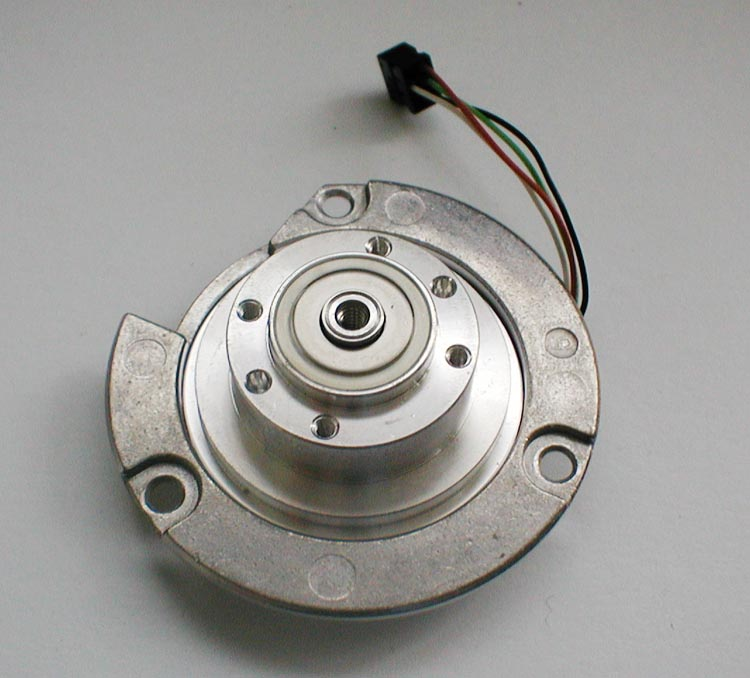
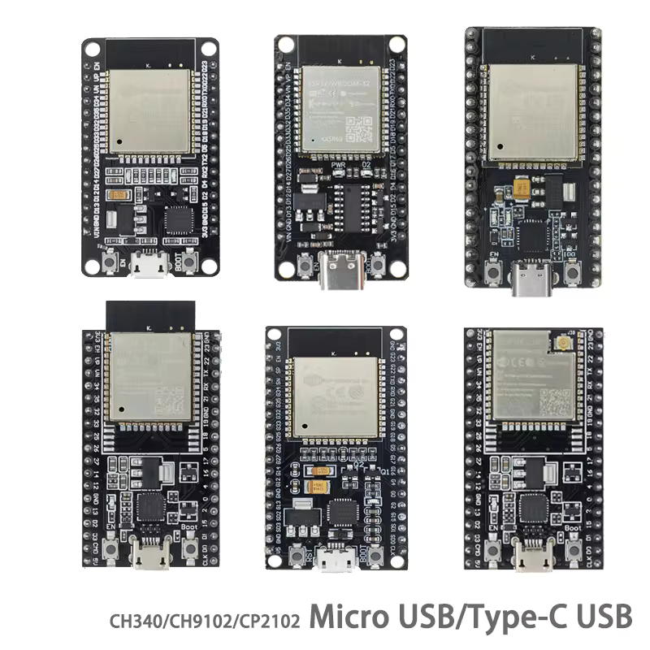
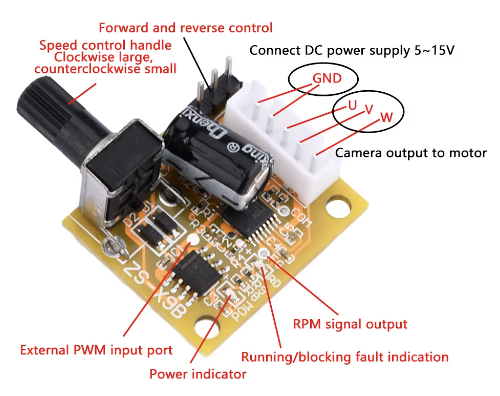

# BLDC speed governor

This is a program that runs on a microcontroller and communicates with BLDC driver board in order regulate the motor to run with constant speed.

Most of the boards that are available to drive a brushless DC motor have the speed control knob but in reality this a torque control. In practice, you
cannot command the driver to run motor at 1000 RPM regardless the load. If the load increases even slightly, the motor will slow down because the constant
torque provided by driver is not enough to maintain 1000 RPM at increased load. To solve that problem, one needs to monitor the speed of the motor and
regulate the torque command in order to keep the speed constant. One mechanism to perform this action is [PID controller](https://en.wikipedia.org/wiki/Proportional%E2%80%93integral%E2%80%93derivative_controller)

Inputs:
- target motor speed, input from user
- measured motor speed from [frequency generator](https://www.nidec.com/en/technology/motor/glossary/item/frequency_generator/) terminal on the motor driver board (digital, variable frequency pulse signal)

Outputs:
- torque command that is needed to maintain the target motor speed, sent to PWM input port on the motor driver board (digital signal, pulse width modulation)

## Hardware parts

### BLDC motor

I used 8-pole 12-stator motor from hard disk drive.

Image source: [Wikipedia](https://commons.wikimedia.org/wiki/File:Hdd_motor.jpg)

### ESP32-DevKit board

Image source: [Aliexpress](https://pl.aliexpress.com/item/1005006984808772.html?src=google&src=google&albch=shopping&acnt=708-803-3821&isdl=y&slnk=&plac=&mtctp=&albbt=Google_7_shopping&aff_platform=google&aff_short_key=UneMJZVf&gclsrc=aw.ds&&albagn=888888&&ds_e_adid=&ds_e_matchtype=&ds_e_device=c&ds_e_network=x&ds_e_product_group_id=&ds_e_product_id=pl1005006984808772&ds_e_product_merchant_id=5388525816&ds_e_product_country=PL&ds_e_product_language=pl&ds_e_product_channel=online&ds_e_product_store_id=&ds_url_v=2&albcp=20225003196&albag=&isSmbAutoCall=false&needSmbHouyi=false&gad_source=1&gclid=Cj0KCQjwi5q3BhCiARIsAJCfuZldI-xi0LPcc-X7QuJDXSF7Gr6l1HxTJ66F1SkDM3vqXOecG8cDO6QaAkuIEALw_wcB)

### BLDC driver board

The board used is DRV11873 based as shown below. 

IC datasheet: [DRV11873 12-V, 3-Phase, Sensorless BLDC Motor Driver = sensorless, trapezoidal, 150 deg, pseudosinusoidal (2012), current 1.5A](https://www.ti.com/lit/ds/symlink/drv11873.pdf?ts=1726404484520&ref_url=https%253A%252F%252Fwww.google.com%252F)

Image source: [Aliexpress](https://pl.aliexpress.com/item/1005006573854501.html?spm=a2g0o.detail.pcDetailBottomMoreOtherSeller.24.6b70TfXnTfXngG&gps-id=pcDetailBottomMoreOtherSeller&scm=1007.40196.366102.0&scm_id=1007.40196.366102.0&scm-url=1007.40196.366102.0&pvid=b0edfcc1-b0e8-4de1-8373-2ef1dfb4b870&_t=gps-id:pcDetailBottomMoreOtherSeller,scm-url:1007.40196.366102.0,pvid:b0edfcc1-b0e8-4de1-8373-2ef1dfb4b870,tpp_buckets:668%232846%238111%231996&pdp_npi=4%40dis%21PLN%2139.00%2123.19%21%21%2169.83%2141.53%21%40211b619a17254605761158640e3a52%2112000037708364695%21rec%21PL%21%21ABX&utparam-url=scene%3ApcDetailBottomMoreOtherSeller%7Cquery_from%3A)
